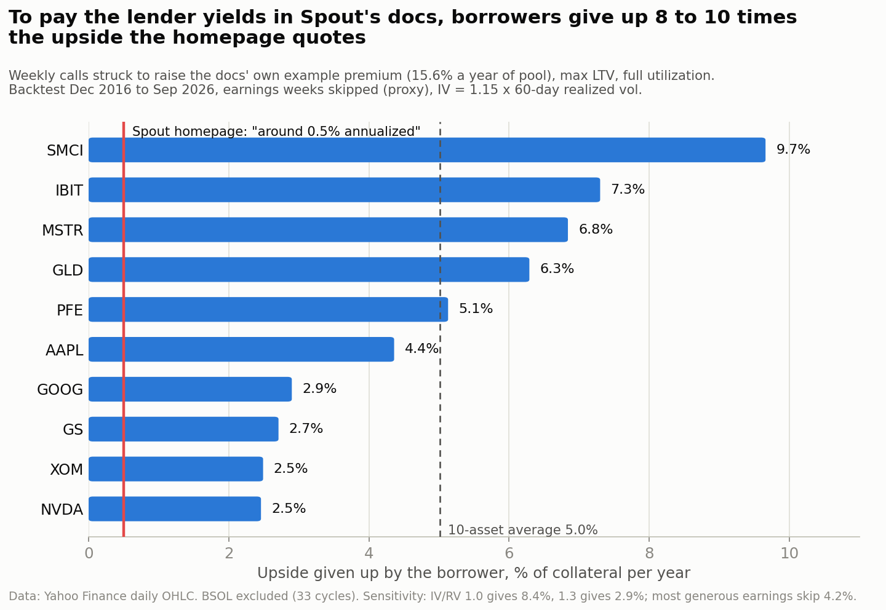
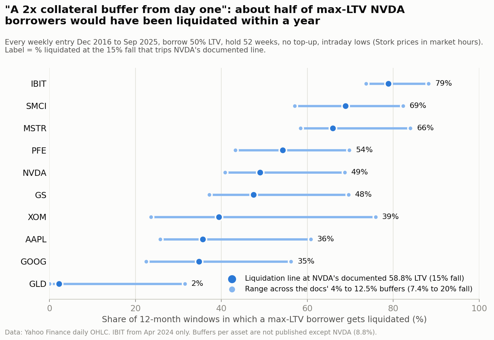
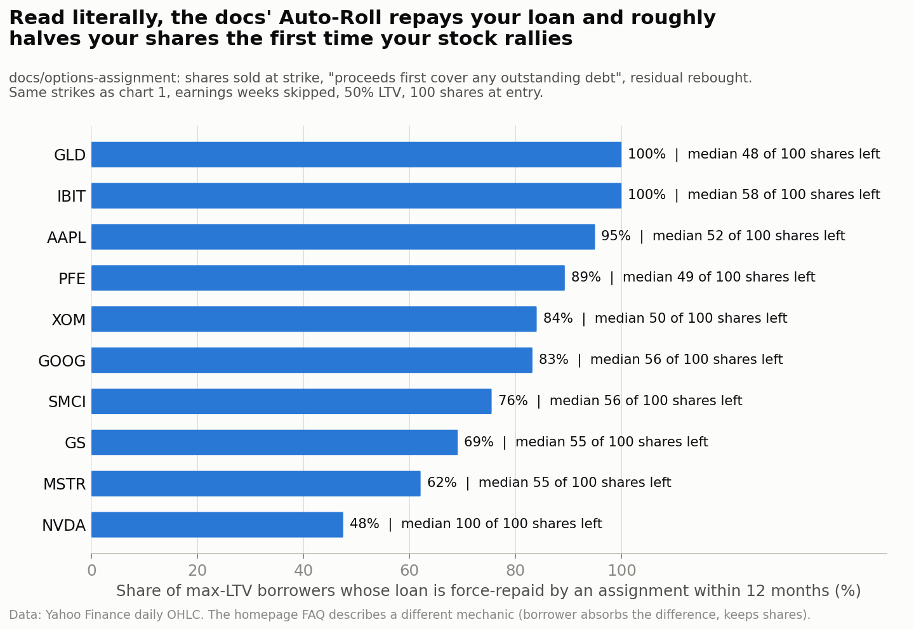

# faenus: what Spout Finance's 0% loan actually costs

An independent product and economics review of the Spout Finance beta, written for the Spout Finance Product Feedback bounty on Superteam Earn. Sergiu Ochinca, [@ochinimus](https://x.com/ochinimus), September 23 2026.

Faenus is Latin for the interest on a loan. The name is the question this review answers.

Everything here is reproducible. [backtest.js](backtest.js) is the exact code behind every market number and runs in a browser console with no API key. [data/summary.json](data/summary.json) holds every figure used below. The charts are in [charts/](charts/).

## The short version

Spout lets you borrow stablecoins against tokenized US stocks at 0% interest. The loan is paid for by selling weekly covered calls on your collateral, and the premium goes to lenders. It is a smart structure, and it deserves a real test. So I backtested it on 4,732 weekly cycles across all 11 launch assets, from December 2016 to September 2026. I checked the results against today's live option chain and against the programs Spout has deployed on chain. I also read all 40 docs pages, the homepage and the Terms line by line.

Six findings matter most.

1. The homepage says the covered calls cost borrowers "around 0.5% annualized". The docs promise lenders about 9% senior and 32% junior. Both cannot hold at once. Strikes close enough to pay the docs' yields cost a max-LTV borrower 4 to 5% of collateral a year in capped upside. That is 8 to 10 cents per borrowed dollar, 8 to 10 times the homepage figure, and more than the 5.38% Interactive Brokers charges for a margin loan. Strikes far enough out to hold the cost to 0.5% leave lenders about 1.7% a year.
2. The docs say every position "has a 2x collateral buffer from day one". That buffer protects the lender, not the borrower. At NVDA's own documented liquidation line, 49% of max-LTV NVDA borrowers would have been liquidated within twelve months.
3. Read as written, the assignment rule repays your loan out of the sale and roughly halves your shares the first time your stock rallies through the strike. For a max-LTV AAPL borrower, that happened within a year in 95% of the windows tested.
4. BSOL is listed as a weekly asset, but it has no weekly options at all. The nearest listed expiry is a monthly, and the out-of-the-money calls the engine would sell had zero bids.
5. The three public sources of truth disagree on the numbers a user signs up for: the docs, the homepage and the Terms. I found 20 contradictions. They cover origination fees, withdrawal fees, liquidation fees, lockups, yields, who keeps the premium and who pays for assignment.
6. On chain, the beta's vault program has handled 114 borrows from 39 wallets since August 4. It also exposes a SetMockFeed instruction that sets prices by hand, and both core programs can be upgraded by one single-signer key.

None of this makes the idea bad. It makes the pricing and the promises the first thing to fix before mainnet. The recommendations at the end are ordered by impact.

## 1. What I tested and how

Hands-on access was the part I could not complete. The beta gate asks for "the email and passcode we sent you". The bounty page says to request a beta code from @SpoutHelp on Telegram. I asked on the deadline day and no passcode arrived before the deadline. I was not alone: the bounty's public comment thread carries passcode requests from at least five other entrants going back nine days. So I tested everything that does not sit behind the passcode, and I tested it hard.

The deployed product. I read the app's public bundle for its configuration and the programs it talks to, then read those programs and their activity straight off Solana. Section 6 has the results.

The mechanism. I reproduced Spout's weekly cycle on 10 years of daily prices for all 11 assets. Entry is Friday at the open and expiry is the following Friday at the close, per the docs. Strikes are set per asset in volatility units, which is how the docs describe the engine. The premium is priced from each week's trailing realized volatility. Section 2 has the method and the sensitivity.

The market today. I pulled the delayed Cboe option chain on September 23 for the October 2 weekly, which is the cycle Spout would write this Friday.

The documents. I read every docs page, the homepage FAQ, the Terms and the Testnet Terms. Each claim quoted here was re-checked against the live page on September 23.

## 2. How the 0% is paid, and why the two headline numbers cannot both hold

### 2.1 The arithmetic in Spout's own docs

The lending tranches page works through an example. It uses a $10m pool and $30,000 of gross premium a week. After the 20% protocol fee, Senior earns 8.9% and Junior 32.8%. Blended, that is 12.5% for lenders.

$30,000 a week is 15.6% a year of the pool. Premium is earned on borrower collateral, not on lender cash. With every borrower at the 50% maximum LTV and the pool fully lent, collateral is twice the pool. So the calls must raise 7.8% a year of collateral value. That is about 0.15% of the stock price every week.

The borrower does not receive that premium. The homepage says 80% goes to lenders, and the fee page says the other 20% is the protocol's. What the borrower gives up is the upside above each week's strike. That is the real price of the loan, and it is the number the homepage puts at "around 0.5% annualized across the portfolio".

### 2.2 Ten years, 4,732 weekly cycles

For each asset and each week, the backtest sets a strike some number of volatility units above Friday's open. It prices the call Spout would sell and records how much upside the borrower loses if the stock closes above the strike the following Friday. Then it asks two questions. How far out can the strikes sit and still raise the docs' 7.8%? And what does that strike cost the borrower?

The backtest is built to be generous to Spout in two ways. Premium is priced at 1.15 times trailing realized volatility, which assumes options are richly priced. On September 23 the live chain priced most of these names below their 60-day realized volatility. Single-name cycles through earnings are also skipped, as the docs say the engine does. I have no earnings calendar, so I skip the week containing each quarter's largest overnight gap, which is usually the earnings reaction. Two variants test that proxy. Skipping the largest upward gap each quarter, or skipping both, lowers the average cost from 5.0% to 4.2%, and that is the most generous version I could build.

| Asset | Strike needed for the docs' yield (weekly vol units) | Weeks assigned | Borrower's lost upside, % of collateral a year |
|---|---|---|---|
| SMCI | 2.14 | 2.6% | 9.7% |
| IBIT | 2.01 | 3.1% | 7.3% |
| MSTR | 2.14 | 2.2% | 6.8% |
| GLD | 1.39 | 8.9% | 6.3% |
| PFE | 1.58 | 4.5% | 5.1% |
| AAPL | 1.68 | 3.9% | 4.4% |
| GOOG | 1.70 | 3.8% | 2.9% |
| GS | 1.69 | 3.2% | 2.7% |
| XOM | 1.65 | 3.9% | 2.5% |
| NVDA | 1.97 | 1.5% | 2.5% |
| Ten-asset average | | | 5.0% |

BSOL is left out of averages because it has 33 cycles of history.

The average is 5.0% of collateral a year. At the 50% maximum LTV, that is 10.0% of the amount borrowed, so the "0%" loan costs about ten cents per borrowed dollar per year. With the most generous earnings skip it is 4.2%, or 8.4 cents. The sensitivity does not rescue the 0.5%. If options are priced exactly at realized volatility, the cost is 8.4% of collateral. If they are priced 30% rich, it is still 2.9%, almost six times the homepage figure. Without any earnings skip it is 6.5%.

Now run it the other way. Set the strikes far enough out that borrowers lose only 0.5% a year, and the premium drops to about 1.1% of collateral, averaged across the nine assets where 0.5% is reachable. Lenders would get about 1.7% a year, less than a Treasury bill. For IBIT, the borrower cost stays above 0.5% even with strikes 3.5 volatility units out.

So one of the two promises has to give. Either borrowers pay 8 to 10% a year in upside on what they borrow, or lenders earn about 2%.

### 2.3 Whoever eats the assignment, one number breaks

The docs do not agree on who pays when a call finishes in the money. The homepage FAQ tells the borrower "you absorb the difference". The settlement page nets "the cost of assignment" out of premium at pool level, and the insurance fund page covers cycles where "assignment cost exceeds premium". The scenarios page says the lender distribution for that asset goes to zero. Under that reading, the pool pays.

The conclusion does not depend on which reading is right. If the borrower pays, the 0.5% is wrong, as shown above. If the pool pays, lenders keep the premium minus the assignment cost and minus the 20% fee. At the strikes above, that leaves about 2.5% a year for lenders instead of 12.5%. That reading also puts one very bad week on the insurance fund. At the required strike, the worst SMCI cycle, entered on November 15 2024, cost 34.6% of the SMCI collateral in a single week. If SMCI were one eleventh of collateral, that one week is about 6% of the pool. The fund's target is 2%.

### 2.4 Borrowing less does not make it cheaper

Calls are written on all locked collateral, not on the part backing the loan. Suppose borrowers average 25% LTV instead of 50%. The pool then needs less premium per dollar of collateral, since there is more collateral per dollar lent. But each borrower is also borrowing less against the upside they give up. The two effects cancel. Across average LTVs from 25% to 50%, the cost per borrowed dollar stayed at 10.0% to 11.2% a year. A user who locks $20,000 of AAPL to borrow $1,000 gives up upside on the full $20,000. At AAPL's 4.4% that is roughly $870 a year on a $1,000 loan.

### 2.5 What today's option chain says

These are the Cboe delayed quotes for the October 2 weekly on September 23, for 10-delta calls:

| Asset | Spot | Strike | Out of the money | Bid / ask | Mid, % of spot for the week |
|---|---|---|---|---|---|
| MSTR | 167.95 | 205 | 22.1% | 1.01 / 1.18 | 0.65% |
| SMCI | 41.51 | 50 | 20.4% | 0.25 / 0.27 | 0.63% |
| IBIT | 48.83 | 54 | 10.6% | 0.14 / 0.16 | 0.31% |
| NVDA | 228.56 | 245 | 7.2% | 0.64 / 0.65 | 0.28% |
| GOOG | 348.19 | 375 | 7.7% | 0.79 / 0.85 | 0.24% |
| GS | 950.50 | 1020 | 7.3% | 1.59 / 2.70 | 0.23% |
| XOM | 158.92 | 170 | 7.0% | 0.29 / 0.40 | 0.22% |
| GLD | 400.07 | 422 | 5.5% | 0.66 / 0.79 | 0.18% |
| AAPL | 339.84 | 357.5 | 5.2% | 0.54 / 0.62 | 0.17% |
| PFE | 27.90 | 29.5 | 5.7% | 0.02 / 0.05 | 0.13% |
| BSOL | 16.29 | none | no weekly expiry listed | | |

The docs' example needs about 0.15% a week. Today that means selling calls near 10 delta on the quieter names, where roughly one week in ten would finish in the money if the market is priced fairly. Two things stand out. GS and PFE have spreads wide enough that selling at the bid instead of mid gives up a quarter to 40% of the premium, so fills against mid are worth publishing. And BSOL cannot run a weekly cycle on listed options at all. The first listed expiry on September 23 was October 16, a monthly, and the out-of-the-money calls at 19, 21 and 22 had no bid.

## 3. Liquidation: the 2x buffer belongs to the lender

The supported collateral page says the 50% LTV "means every position has a 2x collateral buffer from day one". That describes how far collateral can fall before the lender loses money. The borrower meets a much closer line. Liquidation starts at 50% plus a per-asset buffer of about 4% to 12.5%, so after a fall of 7.4% to 20%. The only asset with a published line is NVDA, at 58.8% LTV, which trips after a 15.0% fall.

I opened a max-LTV position at every weekly entry and held it for a year with no top-up, using intraday lows because Stork prices in real time during market hours.

At NVDA's documented line, 49% of those NVDA borrowers were liquidated within twelve months, 30% within a quarter and 17% within four weeks. Each liquidation also charges a fee equal to the buffer, 8.8% on NVDA, on the collateral sold. The spread across buffers is wide, from about a quarter to 61% for AAPL and from 58% to 84% for MSTR. That is why the per-asset buffers should be published.

The same data gives a usable default. Take the 90th percentile of a year's worst fall from entry: 27% for AAPL, 50% for NVDA, 63% for SMCI, 74% for MSTR and 12% for GLD. For NVDA, a borrower who wants nine chances in ten of getting through a year untouched should start near 29% LTV, not 50%. That is the number the borrow slider should open at.

Weekends matter too. The oracle page says prices update "at reduced frequency during off-hours". Over ten years, MSTR opened a Monday 27.4% below Friday's close, on August 5 2024, and IBIT 20.4% on the same day. MSTR had nine weekend gaps worse than 7.4%. None came near the roughly 50% fall that would leave the pool short, so this is borrower risk, not lender risk. But borrowers should see it before Friday's close.

## 4. Assignment and Auto-Roll: the loan closes in the week the stock rallies

The options assignment page is specific. The shares are sold at the strike. "The proceeds first cover any outstanding debt you have." The remainder is rebought with Auto-Roll on, "restoring your position". The scenarios page tells the same story for Carol, who ends up "with slightly fewer shares".

That is only true for someone with no debt. Take 100 MSTR shares, a strike 8% up and a 12% rally, as in the scenarios page. With no loan, Carol ends with 96.4 shares. With a loan at 25% LTV she has 74.1. At the maximum she has 51.8. Her loan is gone, and so is about half of her exposure, in the one week she most wanted to hold.

At the strikes from section 2, that is the normal outcome. Within a year, the loan was repaid by an assignment for 95% of max-LTV AAPL borrowers, 100% of GLD and IBIT, 89% of PFE, 83% of GOOG, 76% of SMCI and 62% of MSTR. The median borrower ended the year holding 48 to 58 shares out of 100. NVDA was the exception at 48%, because its strikes sit further out relative to its volatility. The introduction page promises "You keep every share you started with" and "no taxable event". An assignment is a sale, and for many users it is a taxable one.

The homepage describes a different mechanism: the borrower absorbs the difference and positions are "fully reconstituted". That version is the better product. Net-settle the in-the-money amount against collateral, keep the loan open and keep the share count close to where it was. Then tell the user what happened.

## 5. Calendar and execution details the docs leave open

The Friday overlap. New calls are written "at Friday's market open", and the previous cycle is evaluated "Friday at market close", with settlement and Auto-Roll rebuys on Monday at 9:00am ET. Read together, on every Friday one set of shares backs two sets of calls. After an assignment, the new week's calls sit over shares that were just called away until Monday's rebuy. If the new cycle actually starts a week later, there are half as many cycles a year and half the premium. Either way, the sequence needs one clear sentence in the docs.

Holidays. Good Friday 2027 falls on March 26 and the market is closed, so there is no Friday entry or expiry. Weekly options expire on the Thursday. Day-after-Thanksgiving sessions close early. The docs are silent on all of it.

Cadence. The supported collateral table lists all 11 assets as weekly. The tuned-per-asset page and the Terms say a few run biweekly. BSOL has no weekly options at all.

Strike rule. The single most important parameter for both borrowers and lenders is never given as a number. The only figure in the docs is an MSTR strike 8% above spot. At MSTR's recent volatility that is well under one weekly standard deviation, far closer than the "meaningfully out of the money" the strike page describes.

## 6. What the beta looks like on chain

The beta app's public bundle names its programs and settings. I read them from the bundle and checked each one on chain.

The app talks to api.devnet.solana.com. The launch post says "Solana Testnet", and the pinned X post says testnet too. Anyone checking their transaction on a testnet explorer will find nothing.

The config names an orders program, SPoRXgsB4gWZmWPwyndoRWQrmZXKUc7o7oPMdkkGRcG, and a vault program, spvaDgABYdpFKyatqo4Jr3nfwvVgWF5BbFxKFkzN3Am. Both are upgradeable, and both have the same upgrade authority, 7N31cE8BRTpyAVDeczkutP4EnGdQJLSQm4q3SJ6aYWEp. That account is the fee payer and only signer on its own recent transactions, so it is a single key, not a multisig. A multisig vault cannot sign as a fee payer. The on-chain identity program, SKYCVrkX3mQaHwZcLrUtuvzii43kma7kBUim5MaQm6k, has a separate single authority. This is normal on devnet. For mainnet, the docs should publish the program IDs, the authority and the multisig and timelock behind it. Right now the docs name no address at all: no program, no Proof of Reserve account and no insurance fund.

Activity to September 23, 18:09 UTC. The orders program has 3,198 transactions since June 8, all successful. The vault program, where borrowing lives, has 340 since August 4, sent from 39 distinct wallets, and one wallet sent 38% of them. The USDC account the config labels as Alpaca's has 2,700 transactions since July 27 and a zero balance, so it is swept. Buying and selling runs about nine transactions for every one on the vault, so the product's headline is its least used flow.

The vault's program logs show what beta users actually did across 338 transactions. There were 97 collateral deposits, 114 borrows, 36 repayments and 10 collateral top-ups. Four positions were liquidated, each through a SeizeCollateral and a SettleLiquidationDownside call. Lending barely exists yet, with one liquidity deposit in total, which matches the docs' note that the lending market is still rolling out.

The orders program shows the friction users hit. In its most recent 600 transactions, 59 wallets placed 343 buy orders and 12 sell orders. In the same window the program filled 126 buys and 5 sells and received 102 cancel requests, so nearly one buy order in three drew a cancel. I cannot see the reason from outside. One likely cause is that fills wait for the broker, so an order placed at night or at the weekend just sits. Whatever the cause, the app should show the expected fill time before the user confirms and the order's status after.

Two instructions need attention before mainnet. The vault exposes SetMockFeed, which sets a price by hand, and it was called 7 times. That is fine on devnet. It must not exist in the mainnet binary, and a verifiable build is the way to prove it. There were also 46 MigrateVaultPosition and 19 MigrateCollateralType calls, so live positions were rewritten by upgrades. Freeze the account layout before the audit, not after it.

## 7. Product insight: who this is for, and how to sell it honestly

The docs sell to Americans. They compare Spout with US retail margin loans at 8 to 13% a year, and they talk about writing the IRS a check. The Terms say the user must not be "a U.S. person as defined in Regulation S", and the United States is on the restricted list. So the docs pitch the one market the Terms exclude.

The market Spout can serve is large and already on chain. It is non-US holders of tokenized US stocks. Spout's own weekly roundup put tokenized-equity holders above 1 million wallets. On Solana, Kamino handles about 82.6% of tokenized stock lending volume, and tokenized stock collateral on Solana peaked near $53 million in late July, per KuCoin News on August 11. Those are the users Spout needs to take. Two product choices follow from that.

First, win the Kamino user with a choice, not a slogan. A Kamino borrower pays a variable rate and keeps full upside. A Spout borrower pays nothing in cash and gives up upside above the strike. Offer both on the same position. Upside mode is the default, and rate mode lets a user keep the upside for a stretch they care about. Spout then becomes a superset of the incumbent instead of a riskier copy.

Second, bring the xStocks and Ondo holders over in one step. The getting-started page invites people who hold xStocks and Ondo tokens, but collateral is Spout's own spAssets. Covered calls need the real shares at Spout's broker, so another issuer's token has to be converted first. A one-click convert, with its price shown, is the growth lever.

Then sell the loan for what it is. Call it "0% interest, paid with upside above this week's strike". Show the strike, how far above spot it sits and the dollar upside at stake, every week. Users who learn about the cap after a rally churn and post about it. Users who were told up front stay.

## 8. UX feedback

The first screen is the gate. It asks for an email and passcode "we sent you" and offers no way to get one: no waitlist link, no Telegram link and no request form. The bounty says "beta code", and the form wants an email plus a passcode. The listing's comment thread shows passcode requests going back nine days. For an invite-only beta that is a choice. For a public bounty it means a hundred-plus reviewers queuing at one support handle, and every reviewer who never gets in writes about the gate instead of the borrow flow. Auto-issue devnet passcodes to bounty applicants, or open devnet behind a captcha, since test assets have no value by the Testnet Terms' own wording.

The docs make users do the arithmetic. The liquidation example says a max-LTV NVDA position "starts at about 1.18". A user needs one sentence instead: "NVDA can fall 15.0% before you are liquidated." Put distance-to-liquidation in the borrow panel as a price, and next to it this week's cap as a price.

The numbers do not agree. These are the contradictions a user will actually trip on. All were re-checked on the live pages on September 23.

| Topic | One page says | Another says |
|---|---|---|
| Origination fee | [fee structure](https://spout.finance/docs/fee-structure): "No origination fee" | [who](https://spout.finance/docs/who): "The only cost is the one-time origination fee on the borrow" |
| Lender withdrawal fee | fee structure: "Withdrawal fee: 0.20%" | [how lending works](https://spout.finance/docs/how-lending-works): "0% Deposit / Withdraw Fees"; [Terms](https://spout.finance/terms): "Withdrawal Fee: 1%" |
| Buy and sell fee | fee structure: 0.20% | Terms: 0.25% on minting and redeeming |
| Liquidation | fee structure: 4% to 12.5% per-asset buffer | Terms: 7.5% to 20% |
| Who keeps the premium | [strike selection](https://spout.finance/docs/strike-selection): "the borrower keeps everything: the premium" | [homepage](https://spout.finance): "80% of the collected premium to lenders"; fee structure: protocol fee 20% |
| Who pays for assignment | homepage: the borrower absorbs the difference | [settlement flow](https://spout.finance/docs/settlement-flow): netted at pool level; [insurance fund](https://spout.finance/docs/insurance-fund): covers the shortfall |
| Keeping shares | [introduction](https://spout.finance/docs/introduction): "You keep every share you started with" | [options assignment](https://spout.finance/docs/options-assignment): shares sold at strike, proceeds repay debt |
| Cadence | [supported collateral](https://spout.finance/docs/supported-collateral): all 11 weekly | [tuned per asset](https://spout.finance/docs/tuned-per-asset): "a few on biweekly" |
| Lender yield | docs: about 9% Senior, 32% Junior | Terms: about 8.67% Senior, 24% to 27% Junior |
| Lockups | homepage: "no lockups on either side" | [withdrawals](https://spout.finance/docs/withdrawals): Junior needs 45 days' notice |
| Junior's position | [what](https://spout.finance/docs/what): "first-loss" | [loss waterfall](https://spout.finance/docs/loss-waterfall): "Second Layer" |
| Tranche split | [lending tranches](https://spout.finance/docs/lending-tranches): "Junior receives all remaining yield" | same page: Senior takes a 25% share above the 7% floor |
| Loss layers | who: insurance fund, then treasury, then the pool | loss waterfall: insurance fund, Junior, Senior |
| What is taken before lenders | fee structure: lenders get the other 80% | [distribution](https://spout.finance/docs/distribution): insurance contribution and an undefined "LP reserve" also come out |
| Access | homepage: "permissionless access" | Terms: KYC through Persona, US persons excluded |
| Network | [launch post](https://spout.finance/learn/introducing-spout-finance-beta-on-solana-testnet): "Solana Testnet" | the app: api.devnet.solana.com |

The fix is one parameter file. Generate the docs tables, the homepage FAQ and the Terms figures from it. Publish a per-asset table in the app and the docs with the buffer, the liquidation line, the cadence and this week's strike.

## 9. Recommendations, in order

1. Pick the true number and publish it. Either raise the advertised borrower cost or lower the lender targets. Section 2 shows both cannot stand, and a user who finds out on their own will say so publicly.
2. Show the price of the loan on every borrow screen: this week's strike, its distance from spot, the dollar upside at stake and a trailing effective cost per borrowed dollar.
3. Net-settle assignments, as the homepage describes, instead of repaying the loan out of the sale. Keep the loan open and the share count near where it was. Notify the user and offer a one-tap re-borrow if anything changes.
4. Enroll only the collateral that backs the loan, or let users choose how much is locked, so borrowing a little does not cost as much upside as borrowing a lot.
5. Open the borrow slider at a data-driven safe LTV per asset, about 29% for NVDA on ten years of data. Show distance to liquidation as a price fall, not a health factor.
6. Show when a buy or sell will fill before the user confirms it, and its status after. On devnet, nearly one buy order in three drew a cancel request.
7. Publish the per-asset parameters: buffer, liquidation line, cadence, strike rule and execution quality against mid. Take BSOL off the weekly list until weekly options exist.
8. Write down the Friday sequence and the holiday rules: overlap or gap, Good Friday, early closes and Monday holidays for the 9am settlement.
9. Before mainnet, move both program upgrade authorities to a multisig with a timelock, ship a verifiable build with no SetMockFeed path, and publish the program IDs, the Proof of Reserve account and the insurance fund address in the docs.
10. Offer a rate mode next to upside mode, so a Kamino borrower gets a choice rather than a trade-down.
11. Auto-issue devnet passcodes to bounty applicants, and call the network by its real name.

## Method and limits

Prices are split-adjusted daily open, high, low and close from the Yahoo Finance chart API, September 23 2016 to September 23 2026. Volatility is measured over the 60 trading days before each entry. A cycle enters at the open of the week's last session and expires at the close of the next week's last session. The strike sits k weekly standard deviations above entry, with k solved per asset. The premium is Black-Scholes with zero rates and implied volatility at 1.15 times realized. Sensitivity is reported at 1.0 and 1.3. Borrower cost is the in-the-money amount at expiry divided by the entry price, summed and annualized, as the homepage describes it. The earnings skip is the proxy described in 2.2. Liquidation uses intraday lows against the entry open. Assignment and Auto-Roll follow the options assignment page literally, with the rebuy at the expiry close.

The limits are real. There is no earnings calendar, so the skip is a proxy, tested three ways with results between 4.2% and 5.0%. No dividends are modeled, which is small over a week. Premium is modeled, and the live chain is shown alongside for a check. The period includes a long bull market for most of these names, which raises covered-call costs. That is also exactly the market in which people buy tokenized AI stocks. IBIT starts in 2024 and BSOL in late 2025. Spout's own strike rule is not public, so the backtest solves for the strike its published yields require.

## Reproduce it

Open https://query1.finance.yahoo.com/v8/finance/chart/AAPL in a browser, open the developer console, paste [backtest.js](backtest.js) and press Enter. It prints the JSON behind every backtest figure here. The on-chain reads in section 6 are plain JSON-RPC calls to api.devnet.solana.com: getAccountInfo on the program IDs and their program data accounts, getSignaturesForAddress for the counts, and getTransaction for the instruction names in each transaction's logs.

## About the author

I build market-structure tooling for tokenized assets across several chains. That includes statera, a depth-adjusted valuation engine for tokenized stocks on X Layer, and AgentFeed, a paid x402 market-data API on Solana and Base. I have no relationship with Spout Finance beyond this review. Code on GitHub at [seekdaseek](https://github.com/seekdaseek).
